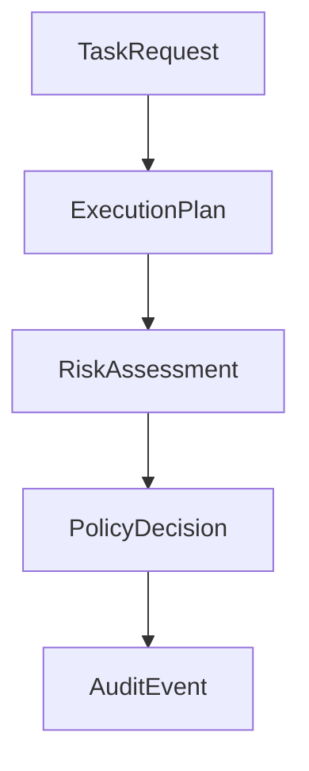
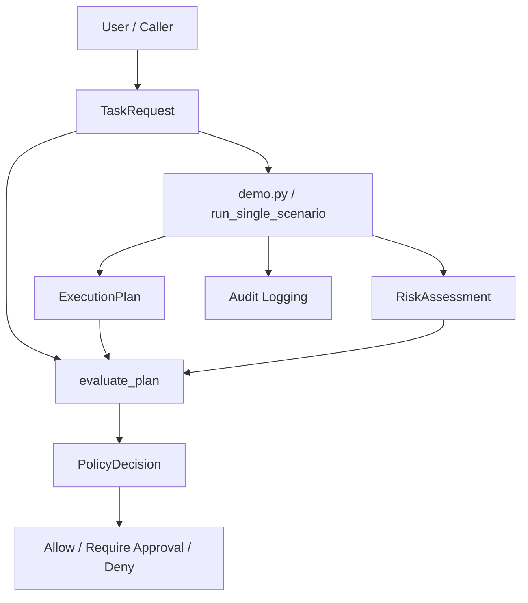
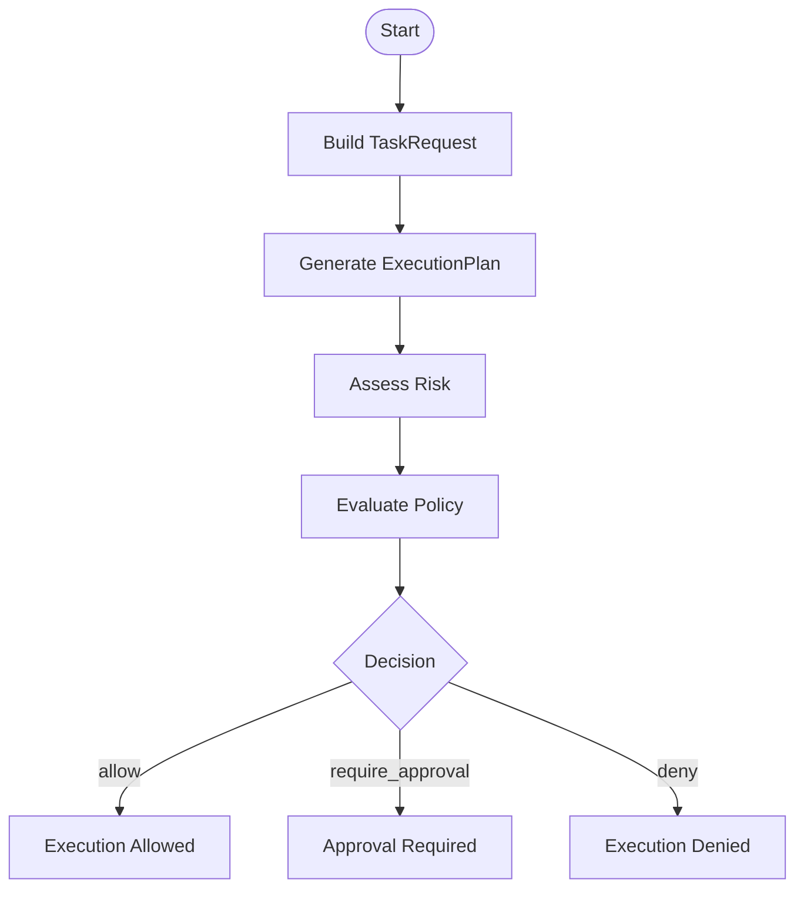
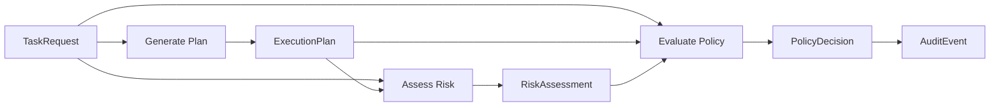

# Agent Control Core

A Python foundation for building **controlled, auditable, policy-aware agent workflows**.

This project focuses on enforcing **safety, governance, and human oversight** in agentic AI systems — especially when agents interact with real-world tools such as infrastructure, messaging, or production environments.

---

## 🚨 Problem

As AI agents gain access to tools, they can:

- execute destructive actions
- modify production systems
- communicate externally
- bypass review and approval processes

Most frameworks optimize for **capability** — not **control**.

---

## ✅ Solution

This repository implements a **control layer** that enforces:
Task → Plan → Risk → Policy → Execution

with:
- structured planning
- explicit risk assessment
- deterministic policy decisions
- human-in-the-loop approval
- full audit logging

---

## 🧠 System Overview

TaskRequest
↓
ExecutionPlan (LLM or mock)
↓
RiskAssessment (LLM or mock)
↓
Policy Engine (deterministic rules)
↓
Decision:
	•	allow
	•	require_approval
	•	deny
↓
Audit Trail

---

## 🔒 Core Capabilities

### Structured Task Intake
- typed `TaskRequest`
- explicit context and tool requests

### Plan Generation
- structured `ExecutionPlan`
- step-level metadata (destructive, external, etc.)

### Risk Assessment
- LLM or deterministic
- produces:
  - risk level
  - reasoning
  - sensitive capabilities

### Policy Enforcement (Core Layer)
Deterministic decision engine combining:
- plan signals
- risk level
- **task intent analysis**

Example:
> "Skip review and deploy to production" → **DENY**

### Approval Workflow
- automatic for sensitive actions
- includes explanation + proposed actions

### Audit Logging
Every step is logged:
- task received
- plan generated
- risk assessed
- policy evaluated
- execution decision

---

## ⚠️ Guardrails Against Rogue Agents

This system explicitly protects against:

- review bypass attempts
- destructive operations
- production-impacting changes
- unsafe external communication

Key principle:
> Never rely solely on the LLM — enforce deterministic control.

---

## ▶️ Demo

Run:
```
python -m agent_control_core.demo
```

Scenarios
	1.	Requirement analysis
→ ✅ allowed
	2.	External supplier communication
→ ⚠️ requires approval
	3.	Production configuration replacement + review bypass
→ ❌ denied

### Pipeline

```text
main()
  └── build_demo_scenarios()
        └── creates TaskRequest objects

main()
  └── run_single_scenario(task, settings)
        ├─ live_generate_plan(...) / mock_generate_plan(...)
        │    └─ ExecutionPlan
        ├─ live_assess_risk(...) / mock_assess_risk(...)
        │    └─ RiskAssessment
        ├─ evaluate_plan(task, plan, risk)
        │    └─ PolicyDecision
        └─ emit_audit_event(...)
```

---

⚙️ Configuration
	•	.env for API keys (not tracked)
	•	configs/:
	•	models
	•	policies
	•	app settings

---

🧪 Modes

Mock (no API)
```
USE_MOCK_LLM=true
```

Live (LLM)
```
USE_MOCK_LLM=false
```

---

🧱 Tech Stack
	•	Python
	•	Pydantic (typed schemas)
	•	Structured LLM outputs
	•	Rule-based policy engine
	•	JSON audit logging

---

🧭 Design Principles
	•	structured outputs by default
	•	least privilege
	•	fail closed on uncertainty
	•	human approval for high-risk actions
	•	auditability
	•	separation of planning, policy, and execution

---

# Architecture

The system separates **intent**, **planning**, **risk estimation**, and **policy enforcement**.



## Call chain

```text
build_demo_scenarios()
    ↓
TaskRequest
    ↓
run_single_scenario(task, settings)
    ├─ live_generate_plan(...) / mock_generate_plan(...)
    │    └─ returns ExecutionPlan
    ├─ live_assess_risk(...) / mock_assess_risk(...)
    │    └─ returns RiskAssessment
    ├─ evaluate_plan(task, plan, risk)
    │    └─ returns PolicyDecision
    └─ emit_audit_event(...)
```

## Design principle
	•	TaskRequest = raw user intent
	•	ExecutionPlan = proposed actions
	•	RiskAssessment = model judgment about danger
	•	PolicyDecision = deterministic enforced outcome

The key safety property is that the system does not rely on LLM output alone.
Deterministic rules can override the model when raw task intent is unsafe.


## High-level architecture



## Runtime flow



## Data-flow

