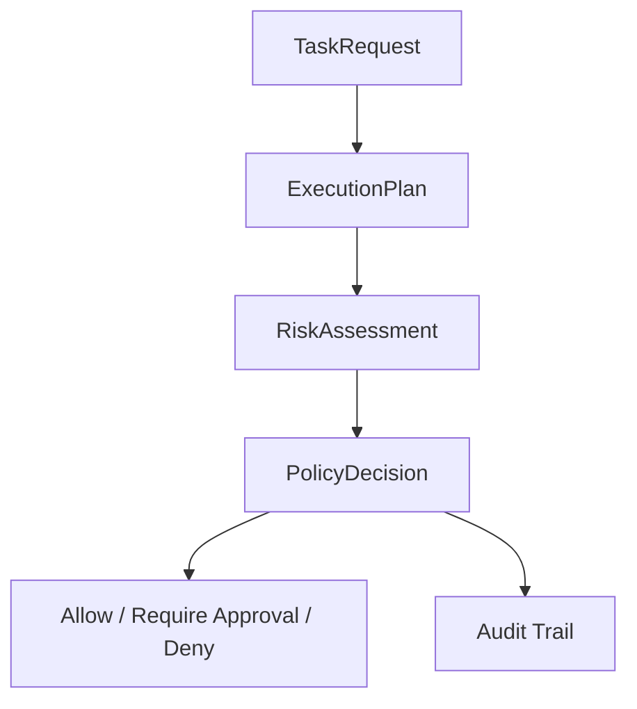
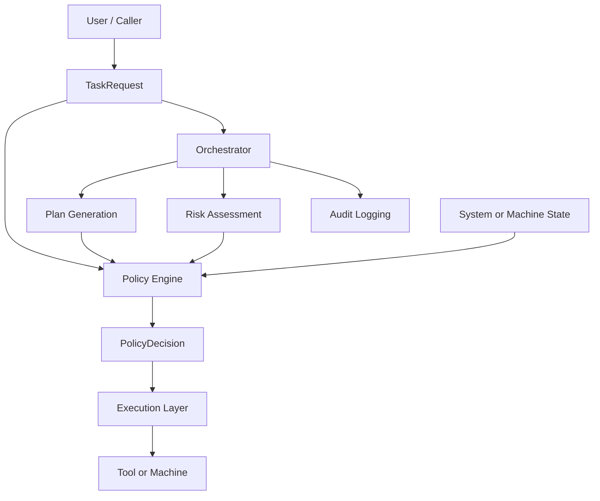
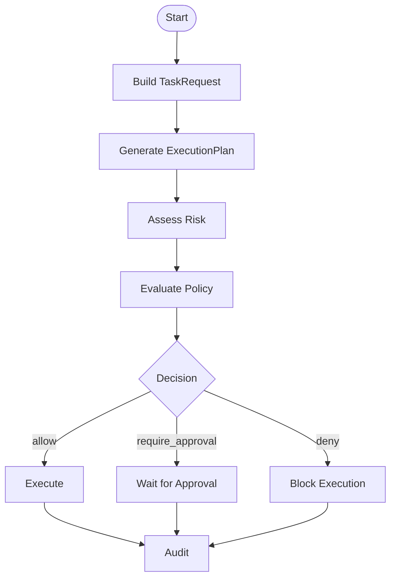
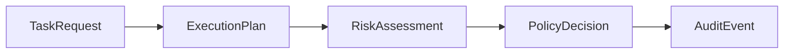

# Agent Control Core

A Python foundation for building **controlled, auditable, policy-aware agent workflows**.

This project focuses on **safety, governance, and human oversight** in agentic AI systems, especially when agents interact with real-world tools such as infrastructure, messaging, production systems, or physical devices.

---

## Table of Contents

- [Problem](#problem)
- [Solution](#solution)
- [Core Capabilities](#core-capabilities)
  - [Structured Task Intake](#structured-task-intake)
  - [Plan Generation](#plan-generation)
  - [Risk Assessment](#risk-assessment)
  - [Policy Enforcement](#policy-enforcement)
  - [Approval Workflow](#approval-workflow)
  - [Audit Logging](#audit-logging)
  - [Guardrails Against Rogue Agents](#guardrails-against-rogue-agents)
- [Generic Demo](#generic-demo)
  - [Included scenarios](#included-scenarios)
  - [Generic demo pipeline](#generic-demo-pipeline)
- [Machine Demo: Guarded Machine Cell](#machine-demo-guarded-machine-cell)
  - [What it demonstrates](#what-it-demonstrates)
  - [Included machine scenarios](#included-machine-scenarios)
- [Interactive Operator Loop](#interactive-operator-loop)
- [System Overview](#system-overview)
- [High-Level Architecture](#high-level-architecture)
- [Runtime Flow](#runtime-flow)
- [Data Model](#data-model)
- [Configuration](#configuration)
- [Modes](#modes)
  - [Mock mode](#mock-mode)
  - [Live mode](#live-mode)
- [Tech Stack](#tech-stack)
- [Design Principles](#design-principles)
- [Why this project matters](#why-this-project-matters)
- [Project Direction](#project-direction)
- [Status](#status)
- [Prototype Scope](#prototype-scope)
- [Current Limitations](#current-limitations)
- [Example Validation Scenarios](#example-validation-scenarios)
- [Current Safety Behaviors](#current-safety-behaviors)
- [What the Prototype Already Proves](#what-the-prototype-already-proves)

---

## Problem

As AI agents gain access to tools, they can:

- execute destructive actions
- modify production systems
- communicate externally
- bypass review and approval processes

Most agent frameworks optimize for **capability**.  
This project focuses on **control**.

---

## Solution

`agent-control-core` implements a **control layer** that enforces a governed pipeline:

**Task → Plan → Risk → Policy → Execution**

It combines:

- structured planning
- explicit risk assessment
- deterministic policy decisions
- human-in-the-loop approval
- audit logging

The core principle is simple:

> Never rely solely on the LLM.  
> Use deterministic control before real-world execution.

---

## Core Capabilities

### Structured Task Intake
- typed `TaskRequest`
- explicit context and requested tools

### Plan Generation
- structured `ExecutionPlan`
- step-level metadata such as:
  - network access
  - external communication
  - credential handling
  - destructive actions

### Risk Assessment
- mock or LLM-based
- produces:
  - risk level
  - reasons
  - sensitive capabilities

### Policy Enforcement
Deterministic decision engine combining:
- task intent
- plan characteristics
- risk level
- machine or system state

Typical outcomes:
- `allow`
- `require_approval`
- `deny`

### Approval Workflow
- automatic for sensitive actions
- includes explanation and proposed actions

### Audit Logging
Every major step is logged, including:
- task received
- state initialized
- plan generated
- risk assessed
- policy evaluated
- approval requested
- execution allowed or denied

### Guardrails Against Rogue Agents

This system explicitly protects against:

- review bypass attempts
- destructive operations
- production-impacting changes
- unsafe external communication
- invalid machine-state transitions

Example:

> “Skip review and deploy to production” → **DENY**

---

## Generic Demo

Run the generic control demo with:

```bash
python -m agent_control_core.demo
```

### Included scenarios

	1.	Requirement analysis
→ allow
	2.	External supplier communication
→ require_approval
	3.	Production configuration replacement with review bypass intent
→ deny

### Generic demo pipeline

main()
  └── build_demo_scenarios()
        └── creates TaskRequest objects

main()
  └── run_single_scenario(task, settings)
        ├─ live_generate_plan(...) / mock_generate_plan(...)
        │    └─ ExecutionPlan
        ├─ live_assess_risk(...) / mock_assess_risk(...)
        │    └─ RiskAssessment
        ├─ evaluate_plan(task, plan, risk, state?)
        │    └─ PolicyDecision
        └─ emit_audit_event(...)

---

## Machine Demo: Guarded Machine Cell

This repository also includes a physical machine demo using an Arduino Uno R4 WiFi.

Run it with:
```bash
python -m agent_control_core.machine_demo
```

### What it demonstrates

The machine demo connects the same control core to a small physical system with:
- machine state
- servo motion
- approval input
- fault handling
- guarded execution over USB serial

### Included machine scenarios
1.	Safe bounded movement
  - machine starts in READY
  - policy allows execution
  - servo moves to the operator setpoint
2.	Calibration with human approval
  - machine requires approval
  - operator presses Button A
  - policy is re-evaluated
  - calibration sequence executes
3.	Unsafe immediate motion request
  - request attempts to bypass normal readiness checks
  - policy denies execution
  - machine enters FAULT

This demonstrates the project’s central principle:

AI can propose actions, but deterministic policy, machine state, and human approval decide what is actually executed.

---

## Interactive Operator Loop

The repository also includes an interactive CLI for guarded machine control:

```bash
    python -m agent_control_core.operator_loop
```

This operator loop is intended for prototype validation of agent-assisted machine control under deterministic guardrails.

It demonstrates:
- live machine-state reads over USB serial
- deterministic machine intent parsing for common operator commands
- bounded servo motion
- approval-gated high-risk actions
- fault and lock recovery
- explicit denial of safety-bypass attempts
- audit logging for every major decision step

The operator loop follows a strict preference order:
1. deterministic machine intent parsing
2. deterministic machine-specific risk assessment
3. deterministic policy evaluation
4. machine execution bundle generation
5. physical execution only for allowed actions

The operator loop is designed to fail closed for unrecognized or unsafe machine-control requests, and the current implementation prioritizes deterministic parsing before any generic planning is considered.

---

## System Overview

At a high level, the system separates:
- intent
- planning
- risk estimation
- policy enforcement
- execution
- auditability



---

## High-Level Architecture



---

## Runtime Flow



---

## Data Model



### Core meanings
- TaskRequest = raw user intent
- ExecutionPlan = proposed actions
- RiskAssessment = advisory judgment
- PolicyDecision = deterministic enforced outcome

The key safety property is that the system does not rely on LLM output alone.

---

## Configuration

Environment variables are loaded from .env.

Typical settings include:
- model configuration
- API keys
- app settings
- serial connection settings for the machine demo

Example:
```bash
USE_MOCK_LLM=true
SERIAL_ENABLED=true
SERIAL_PORT=/dev/cu.usbmodemXXXX
SERIAL_BAUDRATE=115200
SERIAL_TIMEOUT=1.0
```

---

## Modes

### Mock mode

No live model calls:
```bash
USE_MOCK_LLM=true
```

### Live mode

Live model calls:
```bash
USE_MOCK_LLM=false
```

For the machine demo, mock mode is recommended for a stable presentation. But if `USE_MOCK_LLM` is set to `false` interaction with LLM (that is defined in the `.env` file) is possible and working.

---

## Tech Stack
- Python
- Pydantic
- structured LLM outputs
- rule-based policy engine
- JSON audit logging
- Arduino C++ for the machine demo
- USB serial communication for controlled execution

---

## Design Principles
- structured outputs by default
- least privilege
- fail closed on uncertainty
- human approval for sensitive actions
- auditability
- separation of planning, policy, and execution
- deterministic enforcement over model suggestion

---

## Why this project matters

As agents become more capable, the core question is no longer:

| What can agents do?

It becomes:

| What are agents allowed to do, under which conditions, and who decides?

`agent-control-core` is a prototype answer to that question.

It is not just about building agents.
It is about building systems in which intelligent components remain governable.

---

## Project Direction

This repository should be understood as:
- a control architecture for AI-assisted systems
- a foundation for state-aware guarded execution
- a prototype for controlled intelligent systems

That applies to domains such as:
- industrial automation
- robotics
- production systems
- lab or machine workflows
- enterprise agent tooling

---

## Status

Current repository scope includes:
- task intake
- structured planning
- risk assessment
- deterministic policy checks
- approval gating
- audit logging
- state-aware machine demo
- guarded Arduino execution over USB

---

## Prototype Scope

This project is a prototype for evaluating whether an agent can participate in machine control safely when placed behind deterministic guardrails.

It is not intended as a fully autonomous industrial controller.

What the prototype is meant to prove or disprove:

- whether natural-language requests can be converted into bounded machine actions safely
- whether deterministic policy can overrule unsafe or ambiguous model output
- whether hardware approval and machine state can be enforced as first-class control inputs
- whether the system fails closed on unsafe, ambiguous, or adversarial requests
- whether an allowed policy decision can still result in zero physical execution

---

## Current Limitations

Current limitations include:

- machine intent parsing still depends on phrase coverage rather than a formal grammar
- deterministic parsing is strong but not complete
- ambiguous machine-like requests are handled conservatively but still evolving
- limited to a single guarded machine-cell prototype
- validation is scenario-based rather than benchmark-driven

---

## Example Validation Scenarios

The prototype should consistently demonstrate:
- bounded motion within limits → allow
- out-of-range motion → require approval
- explicit safety-bypass attempt → deny
- fault recovery → allow
- lock recovery → allow
- safe shutdown from OFF → allow with zero actions
- repeated lock request while already locked → deny
- ambiguous machine-control request with bypass language → deny or fail closed

---

## Current Safety Behaviors

The prototype currently demonstrates:
- bounded actuator motion
- automatic clamping of unsafe inputs
- approval gating for elevated risk
- approval timeout → reset to OFF
- denial of safety-bypass attempts
- critical bypass → FAULT state
- LOCKED state blocks execution
- FAULT state blocks execution
- safe-state requests may result in zero actions

---

## What the Prototype Already Proves

This prototype answers the core question:

| Can an agent participate in machine control safely under deterministic guardrails?

**Yes — as a controlled, auditable prototype.**

It demonstrates that:
- natural language can drive bounded machine actions
- deterministic policy overrides unsafe behavior
- machine state is a hard execution constraint
- approval is enforceable in hardware
- unsafe or ambiguous requests fail safely
- execution can be separated from model suggestion
- physical actuation remains auditable and controlled