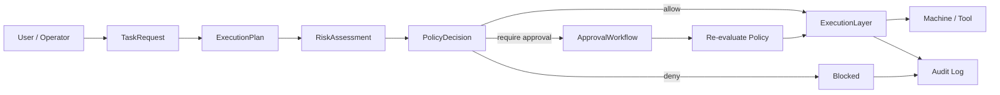
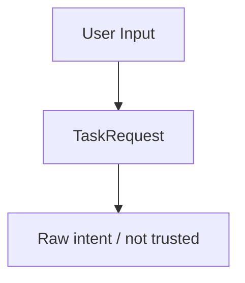
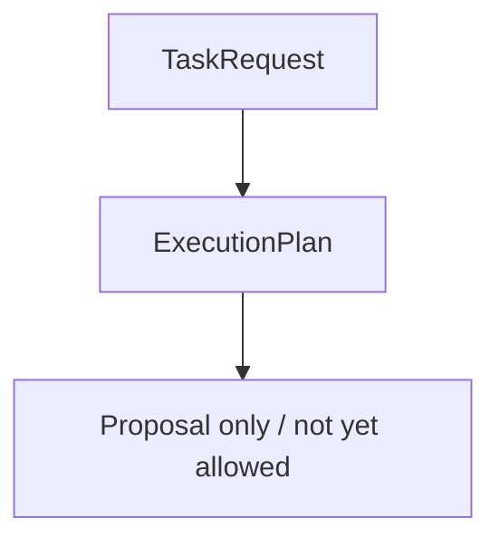
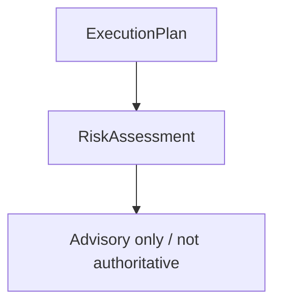
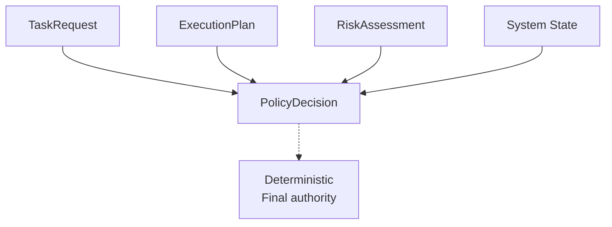
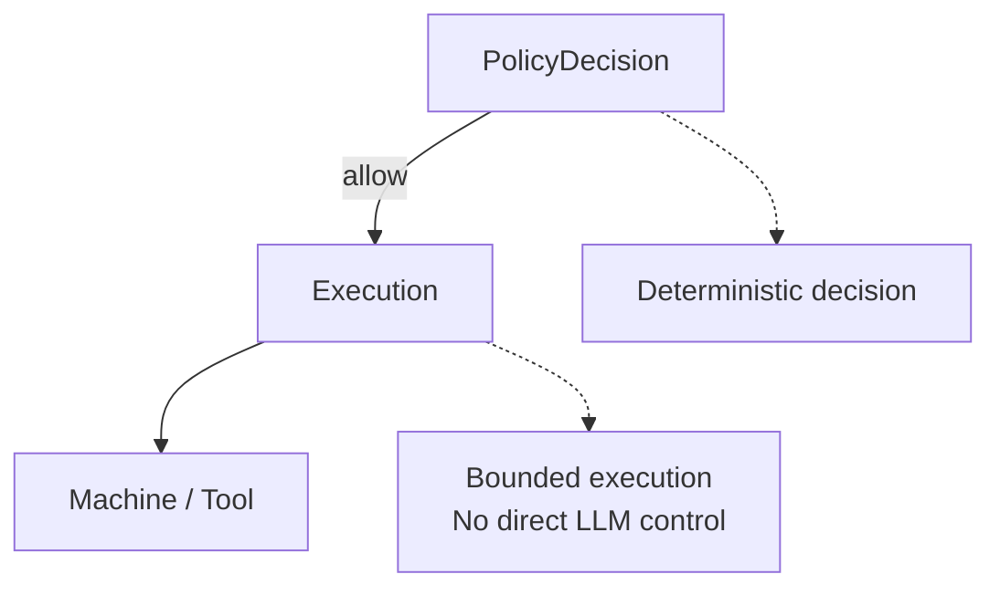
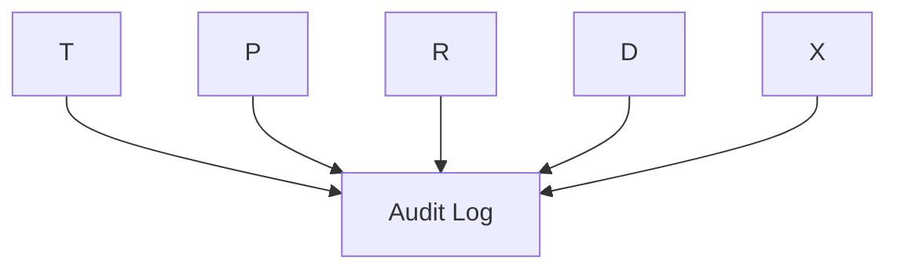
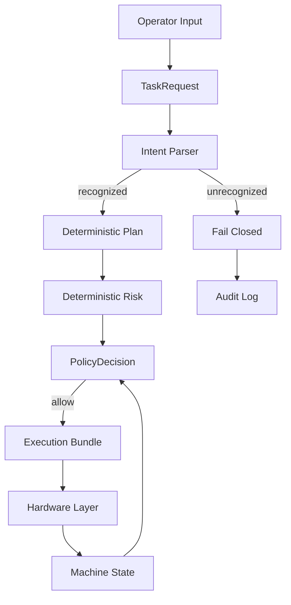
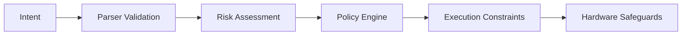
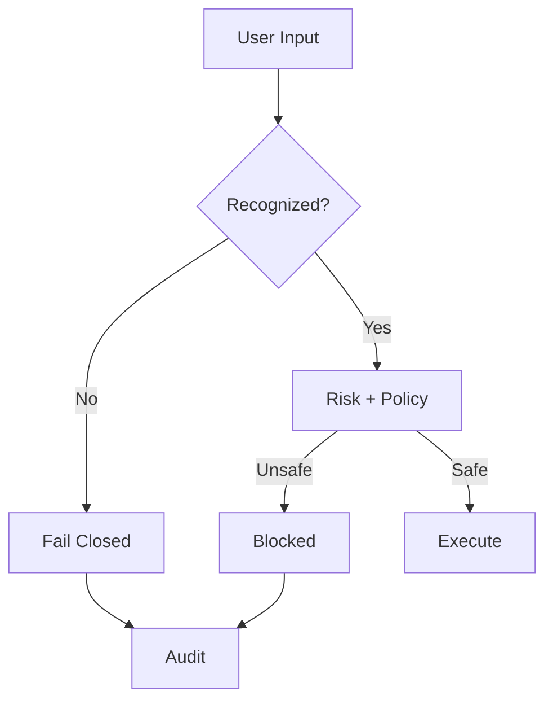

# Architecture

## Overview

Agent Control Core implements a **deterministic control architecture** for AI-assisted systems.

It enforces a strict execution pipeline:

**TaskRequest → ExecutionPlan → RiskAssessment → PolicyDecision → Execution → Audit**

This pipeline ensures that **no action reaches execution without passing structured validation, risk evaluation, and policy enforcement**.

---

## High-Level Control Flow

---

## Core Principle

> The LLM may propose actions — but it never decides execution.

The system separates:

- intent (user / LLM)
- judgment (risk)
- authority (policy)
- execution (controlled layer)

---

## Layered Architecture

### 1. TaskRequest — Untrusted Intent

Represents raw user input:

- defined in: `schemas/tasks.py`
- created in: `demo.py`, `operator_loop.py`

This layer is always treated as untrusted input.

### 2. ExecutionPlan — Proposed Actions

Structured plan describing intended steps:

- defined in: schemas/plans.py
- created by:
- mock_generate_plan()
- live_generate_plan()
- deterministic parsing (machine demo)

Includes metadata such as:

- destructive actions
- external communication
- credential access

### 3. RiskAssessment — Advisory Judgment

Evaluates the potential impact of the plan:

- defined in: `schemas/policies.py`
- created by:
- `mock_assess_risk()`
- `live_assess_risk()`
- deterministic machine risk logic

Produces:

- risk level (low, medium, high, critical)
- reasons
- sensitive capabilities

### 4. PolicyDecision — Authoritative Control

The single point of authority:

- defined in: `schemas/policies.py`
- created by: `policies/engine.py`

Possible outcomes:

- allow
- require_approval
- deny

### 5. Execution Layer — Controlled Actuation

Only executed if policy allows it:

- implemented in: `execution/executor.py`
- uses:
- MachineExecutor
- ExecutionBundle

Important constraint:

> Execution is never performed directly from plan or LLM output.

### 6. Audit Layer — Full Traceability

Every step is logged:

- defined in: `schemas/audit.py`
- logged via: `audit/logger.py`

Provides:

- traceability
- reproducibility
- compliance support

---

## Machine Control Extension

The machine demo extends the architecture with state-aware control and hardware enforcement.

Key additions:

- deterministic intent parsing
- bounded actuator control
- hardware approval input
- state-based constraints

---

## Safety Architecture

The system enforces multiple independent safety layers:

Each layer can independently block unsafe behavior.

---

## Fail-Closed Guarantee

A core property of the architecture:

If the system is uncertain, ambiguous, or detects unsafe intent → it does nothing.

This ensures:

- no implicit execution
- no fallback to unsafe behavior
- no reliance on LLM interpretation alone

---

## Separation of Concerns

| **Layer** | **Responsibility** | **Trust Level** |
| TaskRequest | raw input | untrusted |
| ExecutionPlan | proposal | untrusted |
|RiskAssessment | advisory | semi-trusted |
|PolicyDecision | authority | trusted |
|Execution | actuation | fully controlled |
|Audit | traceability | immutable |

---

## Key Architectural Properties

**Deterministic Control**

> Policy decisions are rule-based and reproducible.

**State Awareness**

> Execution depends on real system or machine state.

**Bounded Execution**

> All actions are constrained before execution.

**Human Oversight**

> Approval is required for sensitive actions.

**Auditability**

> Every decision and action is logged.

---

## Summary

Agent Control Core is not an agent framework.

It is a **control system for agents**.

It ensures that:

- models propose
- systems evaluate
- policies decide
- machines execute under constraint

This separation is what makes safe agent-driven execution possible.