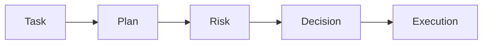
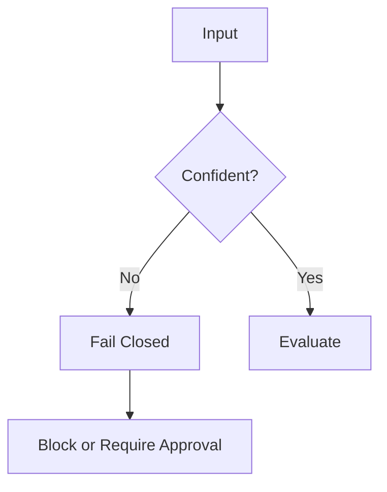

# Design Principles

This system is built around a set of principles that ensure **controlled, auditable, and safe execution** of AI-assisted actions.

---

## System Philosophy

> Models propose — systems decide — execution is constrained.

---

## Structured Outputs by Default

All major workflow steps emit machine-validated data structures.

This ensures:

- predictable behavior
- schema validation
- interoperability between components

---

## Least Privilege

Agents receive only the minimum:

- tools
- permissions
- context

required to complete a task.

This reduces:

- attack surface
- unintended actions
- data exposure

---

## Separation of Concerns

The system separates:

- planning
- risk estimation
- policy enforcement
- approval
- execution

No single component has full authority.

---

## Human Approval for High-Risk Actions

Actions involving sensitive domains require explicit approval:

- financial operations
- external communication
- credential usage
- destructive changes
- legal or contractual commitments

Approval is:

- enforced by policy
- optionally tied to hardware input (machine demo)
- re-evaluated before execution

---

## Fail-Closed Behavior

If the system is uncertain about:

- intent
- risk
- policy applicability

then:

- execution does not proceed
- no fallback to unsafe behavior occurs

---

## Auditability

All major steps generate structured audit events:

- task received
- plan generated
- risk assessed
- policy evaluated
- execution allowed or denied

This enables:

- traceability
- debugging
- compliance

---

## Deterministic Enforcement

Policy enforcement is:

- rule-based
- inspectable
- reproducible

LLMs may assist with:

- classification
- reasoning

But never:

- final execution decisions

---

## Explainability

System decisions must be understandable.

The system provides:

- reasons for denial
- justification for approval
- explanation of required actions

This ensures:

- operator trust
- debuggability
- transparency

---

## Summary

These principles ensure that:

- intelligence is separated from control
- execution is always bounded
- unsafe behavior is systematically prevented

The system is designed not just to act, but to act under governance.
