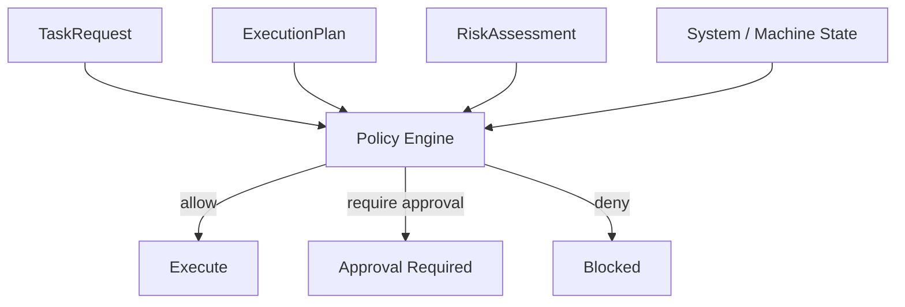
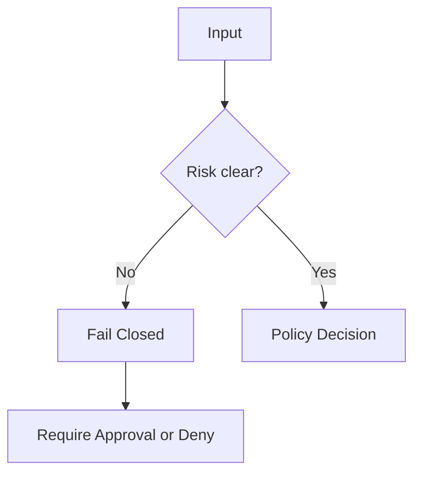

# Policy Model

## Overview

The policy model is the **authoritative decision layer** of the system.

It determines whether a proposed plan:

- may proceed
- must be denied
- requires explicit approval

The policy engine is **deterministic and state-aware**, ensuring that execution decisions are not delegated to the LLM.

---

## Decision Flow

---

## Inputs

The policy decision is based on:

|**Key Elements**| **Explanation**|
|--|--|
| TaskRequest | Raw user intent |
| ExecutionPlan | Proposed actions |
| RiskAssessment | Structured risk evaluation |
| System / Machine State | Current operational constraints |
| Policy Configuration | Static rules and thresholds |

---

## Outputs

The policy engine produces exactly one of:

- `allow` → execution may proceed
- `require_approval` → human or hardware approval required
- `deny` → execution is blocked

---

## High-Risk Triggers

The following characteristics are treated as high risk by default:
	
- money movement or purchases
- external communication
- credential handling
- destructive system changes
- actions with legal or contractual effect

These signals typically result in:

- `require_approval`
- or deny (depending on severity)

---

## Core Principle

> The policy engine is the single point of authority.

LLMs may:

- propose plans
- identify risk signals

But they cannot:

- authorize execution
- override policy decisions

---

## Fail-Closed Behavior

If risk is unclear and the action is sensitive:

- execution is not allowed
- the system either requires approval or denies execution

---

## Deterministic Guarantees

The policy model guarantees:
- no execution without explicit decision
- no implicit trust in LLM output
- consistent decisions for identical inputs
- inspectable and reproducible behavio

---

## Future Extensions

Planned extensions include:

- role-based approval rules
- environment-aware policy (dev vs production vs machine state)
- action-specific constraints
- delegated scopes and session-based permissions
