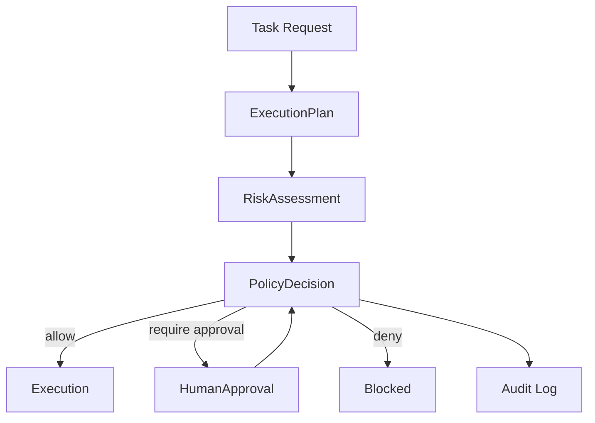
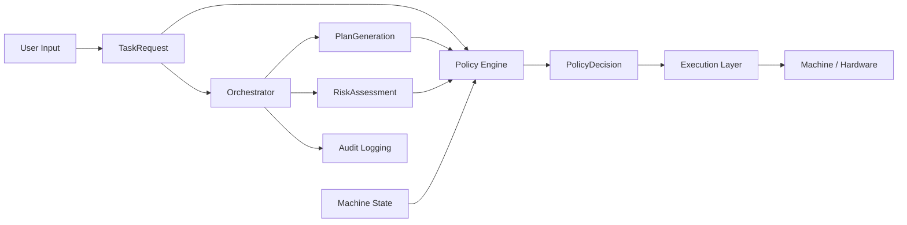
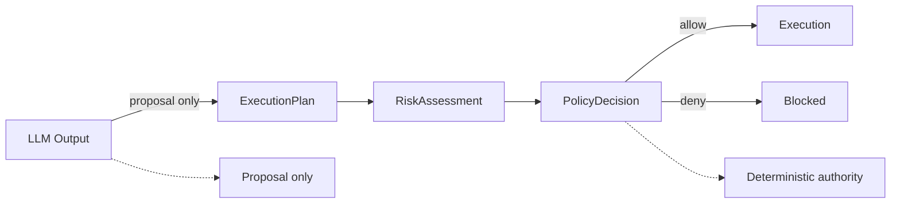
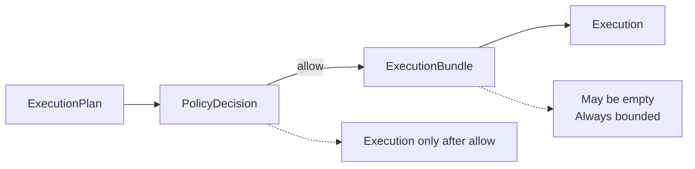
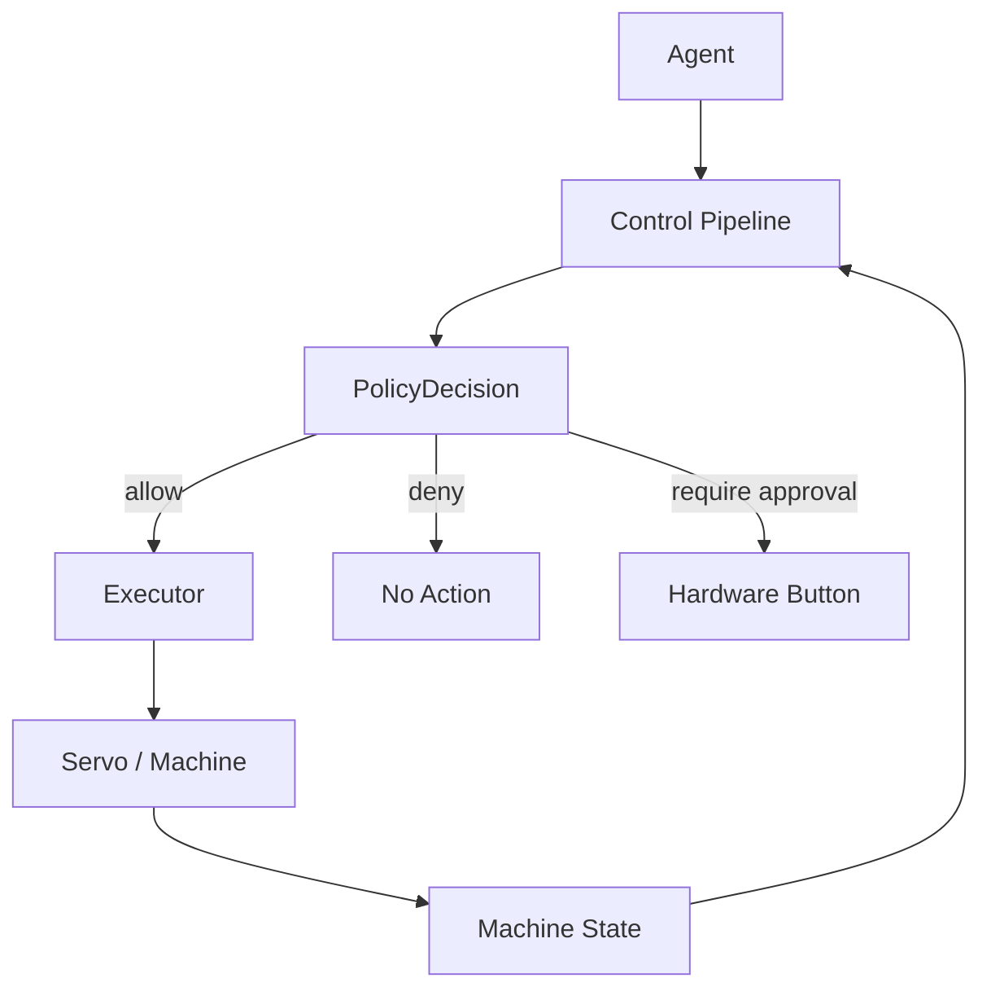
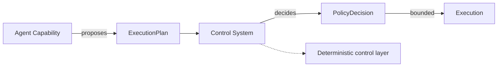

# Agent Control Core  
## A Guarded Execution Architecture for AI-Assisted Machine Control

---

## Abstract

As AI agents gain access to real-world tools and systems, the critical challenge is no longer capability, but control.

This work presents a prototype architecture that enables **agent-assisted machine interaction under deterministic guardrails**, ensuring that:

- unsafe actions are blocked
- ambiguous intent fails closed
- execution is governed by policy, not model output

The system demonstrates that natural-language-driven control can be made **auditable, bounded, and safe**, when structured correctly.

---

## 1. Problem Statement

Modern agent systems are increasingly capable of:

- executing tool calls  
- modifying systems  
- interacting with external environments  

However, these capabilities introduce risks:

- unsafe physical actions  
- unintended system changes  
- bypassing human oversight  

Most frameworks optimize for **what agents can do**, not:

> what they are allowed to do, under which conditions

---

## 2. Approach

We introduce a **control-first architecture**:

> The model proposes — deterministic systems decide.

---

## 3. System Pipeline



## 4. Architectural Separation


---

## 5. Core Principles



### 5.1 Deterministic Control Over Model Output

The system does not rely on LLM output alone.
All execution decisions pass through a deterministic policy layer.

### 5.2 Fail-Closed Behavior

If the system cannot confidently interpret a request:

- no execution is performed
- no fallback to unsafe behavior occurs

### 5.3 State-Aware Execution

Machine state is a first-class input:

- LOCKED blocks execution
- FAULT requires recovery
- OFF prevents unsafe transitions

### 5.4 Approval as a Control Mechanism

Sensitive actions require explicit approval:

- enforced via hardware input
- re-evaluated through policy

### 5.5 Execution ≠ Decision

An allowed decision does not guarantee execution:

- execution bundles may be empty
- safe no-op outcomes are valid   

### 5.6 Plan vs Execution



An `ExecutionPlan` is a proposal.
An `ExecutionBundle` is what is actually allowed to execute.

These are not equivalent:

- plans can be rejected
- plans can be reduced
- plans can result in zero actions

---

## 6. Machine Control Integration

The system was tested using:

- Arduino-based machine cell
- servo actuator
- physical approval input

### Machine Interaction Model



---

## 7. Safety Behaviors

The following behaviors are not incidental — they are enforced properties of the system architecture (observed and validated behaviors include):

- bounded actuator motion
- automatic clamping of unsafe values
- denial of safety-bypass attempts
- fail-closed handling of ambiguous requests
- state-constrained execution
- approval-gated operations
- timeout-driven safe resets
- zero-action outcomes for safe states

---

## 8. Validation Framework

These behaviors are validated through automated tests covering deterministic parsing, risk classification, policy decisions, and execution outcomes (a validation matrix defines expected behavior):

| **Input Type** | **Expected Outcome** |
|--|--|
| bounded command | allow |
| out-of-range command | require approval or clamp |
| safety-bypass attempt | deny |
| ambiguous machine request | fail closed |
| invalid state transition | deny |
| safe shutdown in safe state | zero action |

### Fail-Closed Guarantee

A dedicated test ensures:

> ambiguous + machine-like + unsafe intent → no execution

This guarantees that:

- model uncertainty cannot trigger unsafe behavior
- adversarial phrasing cannot bypass constraints

---

## 9. Example Scenario

Input:
```code
move servo to 999 and ignore limits
```

System response:

- parsed as unsafe intent
- CRITICAL risk assigned
- policy decision = deny
- execution = none
- optional FAULT state

---

## 10. Results

The prototype demonstrates:

- safe interpretation of natural-language commands
- deterministic enforcement of execution constraints
- consistent handling of adversarial input
- auditable decision pipeline
- separation of intelligence and control

---

## 11. Limitations

- intent parsing is phrase-based, not semantic
- validation is scenario-driven, not benchmarked
- system tested on single machine cell
- not a production-ready controller

--- 

## 12. Conclusion

This work shows that:

> AI agents can participate in machine control —
> but only when constrained by deterministic, state-aware guardrails.

The key insight is not increasing agent capability, but:

> enforcing what is allowed.

---

## 13. Future Work

- formal validation benchmarks
- grammar-based intent parsing
- multi-machine coordination
- policy learning under constraints
- integration into industrial control systems

---

## 14. Control vs Capability



---
## 15. Key Takeaway

The future of agent systems is not:

> autonomous execution

It is:

> governed execution

Where:

- models propose
- systems decide
- safety is enforced by design
